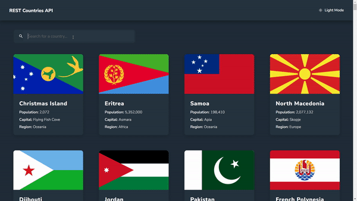

<div align="center">
  <h1 align="center">REST Countries API app</h1>
</div>

<br/>

This app was made using [React](https://react.dev/) + [Express.js](https://expressjs.com/)

## Features

- Display all countries on the homepage
- Search for a specific country using the search bar
- Click on a country to view more details about it

## Demo



## Tech Stack

- [Express.js](https://expressjs.com/) - framework
- [React](https://react.dev/) – framework
- [Vercel](https://vercel.com/) – hosting

## Getting Started

### Prerequisites

Here's what you need to be able to run the app on your machine:

- [Node.js](https://nodejs.org/en/)

### 1. Clone the repository

```shell
git clone https://github.com/dbalampanidis/rest-countries-api.git
cd rest-countries-api/server/
```

### 2. Install npm dependencies

```shell
npm run build
```

### 3. Run the dev server

```shell
npm run dev
```

### 4. Open the app in your browser

Visit [http://localhost:3000](http://localhost:3000) in your browser.
